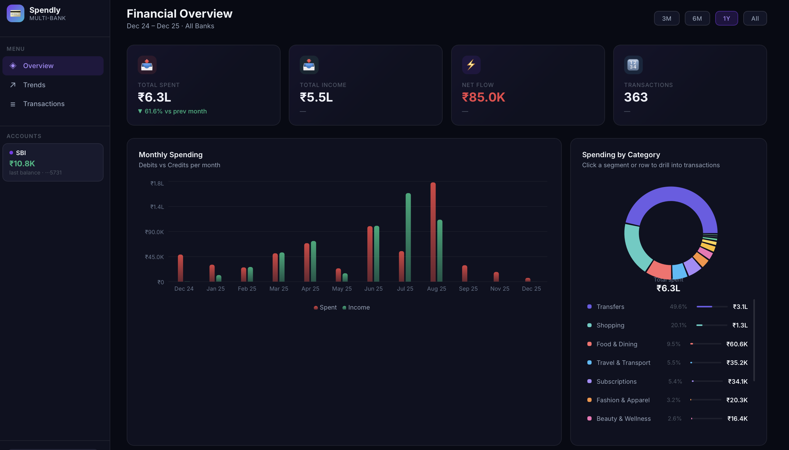
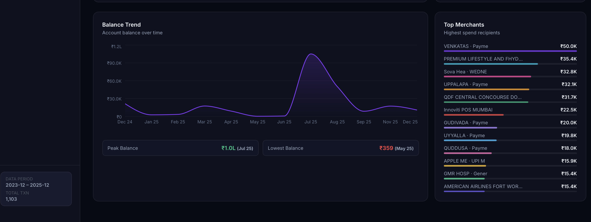
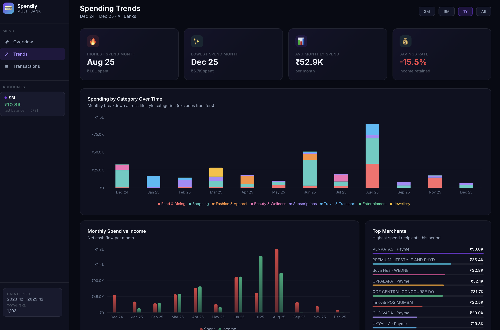
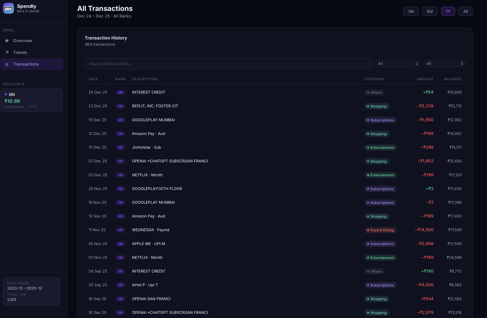
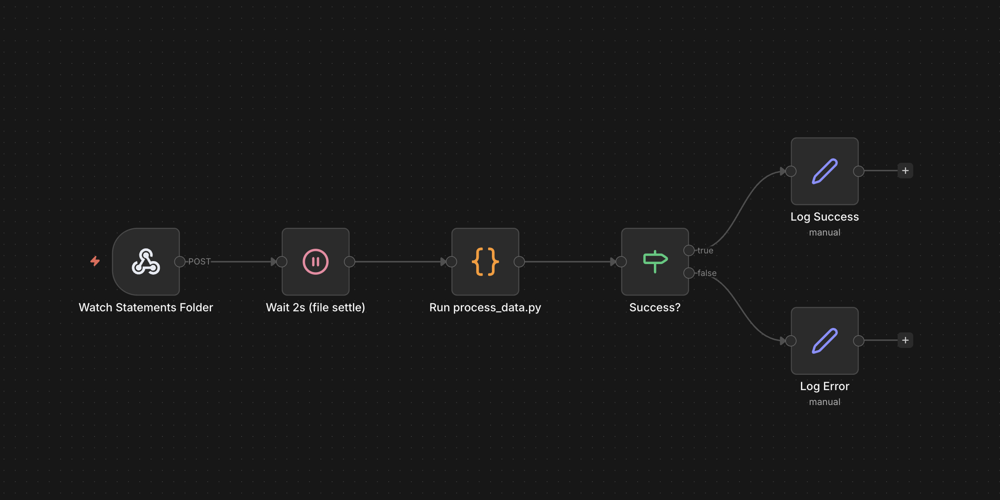

# Spendly — Multi-Bank Statement Tracker

A personal finance pipeline that parses bank/credit card statements from multiple banks, categorizes transactions, and displays them in an interactive dashboard.

## Screenshots

### Overview
Summary cards, monthly spending bar chart, and spending by category donut chart.



### Balance & Top Merchants
Account balance trend over time and highest-spend merchants.



### Spending Trends
Category breakdown over time, spend vs income, and savings rate.



### Transactions
Searchable, filterable transaction list with categories and running balance.



## Supported Banks

| Bank | Format | Type |
|------|--------|------|
| SBI (State Bank of India) | XLSX | Debit |
| SBI Credit Card | PDF | Credit Card |
| Chase | CSV | Debit / Credit |
| Bank of America | CSV | Debit |
| Citi | CSV | Debit |
| Wells Fargo | CSV | Debit |
| American Express | CSV | Credit Card |
| Capital One | CSV | Credit Card |

## Project Structure

```
├── process_data.py          # Main entry point — orchestrates parsing & output
├── categorizer.py           # Rule-based transaction categorizer
├── parsers/
│   ├── base.py              # Transaction dataclass & abstract parser
│   ├── detect.py            # Auto-detects bank from folder name / headers
│   ├── sbi.py               # SBI debit (XLSX)
│   ├── sbi_cc.py            # SBI credit card (PDF)
│   ├── chase.py             # Chase (CSV)
│   ├── bofa.py              # Bank of America (CSV)
│   ├── citi.py              # Citi (CSV)
│   ├── wellsfargo.py        # Wells Fargo (CSV)
│   ├── amex.py              # Amex (CSV)
│   └── capitalone.py        # Capital One (CSV)
├── dashboard/               # React + Vite dashboard
│   └── src/
│       ├── App.jsx           # Main app — Overview, Trends, Transactions views
│       └── components/       # Charts (Recharts) and transaction list
├── statements/              # Drop your statements here, organized by bank
│   ├── SBI/
│   ├── Chase/
│   ├── BofA/
│   ├── Amex/
│   └── ...
├── n8n_workflow.json        # n8n workflow for auto-processing new files
└── ecosystem.config.js      # PM2 config to run dashboard + n8n + file watcher
```

## Setup

### Prerequisites

- Python 3.10+
- Node.js 18+
- [pdfplumber](https://github.com/jsvine/pdfplumber) (for PDF parsing)
- [openpyxl](https://openpyxl.readthedocs.io/) (for XLSX parsing)

### Install

```bash
# Python dependencies
pip install pdfplumber openpyxl

# Dashboard dependencies
cd dashboard && npm install
```

## Usage

### Manual processing

```bash
# Process all files in statements/
python3 process_data.py

# Process a single file
python3 process_data.py --file statements/Chase/activity.csv

# Re-process already-known files
python3 process_data.py --force
```

Output is written to `dashboard/src/data/transactions.json`.

### Run the dashboard

```bash
cd dashboard && npm run dev
```

### Automated processing with n8n (optional)

The project includes an [n8n](https://n8n.io/) workflow that automatically processes new statements as they're added.



**How it works:**

```
fswatch (file watcher)
  → detects new file in statements/
  → sends POST to http://localhost:5678/webhook/process-statement
      → n8n receives the webhook
      → waits 2s for the file to finish writing
      → runs python3 process_data.py --file="<path>"
      → logs success or error
```

**Setup:**

1. Install [n8n](https://docs.n8n.io/hosting/installation/) and [PM2](https://pm2.keymetrics.io/)
2. Import `n8n_workflow.json` into your n8n instance
3. Start everything with PM2:

```bash
pm2 start ecosystem.config.js
```

This launches three services:
- **dashboard** — Vite dev server for the React app
- **n8n** — Workflow automation engine (webhook listener)
- **fswatch-trigger** — Watches `statements/` and triggers the n8n webhook on new files

## Adding Statements

1. Create a subfolder under `statements/` named after the bank (e.g., `Chase`, `BofA`, `Amex`)
2. Drop your CSV, XLSX, or PDF statement files into the appropriate folder
3. Run `python3 process_data.py` (or let the file watcher handle it)

The parser is auto-detected based on the folder name or CSV headers.

## Adding a New Bank Parser

1. Create `parsers/yourbank.py` implementing `AbstractBankParser`
2. Register it in `parsers/detect.py` (add to `FOLDER_MAP` and optionally `HEADER_MAP`)
3. Add keyword rules to `categorizer.py` if needed

## Categories

Transactions are auto-categorized by keyword matching into: Food & Dining, Entertainment, Shopping, Travel, Utilities, Healthcare, Education, Investments, and more. Edit `categorizer.py` to customize rules.
